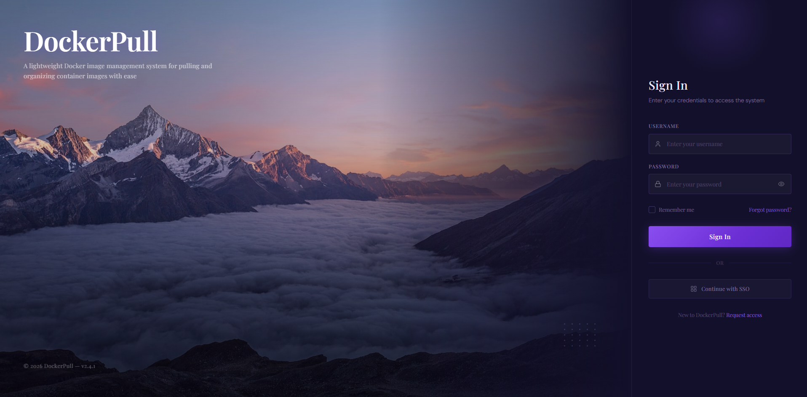
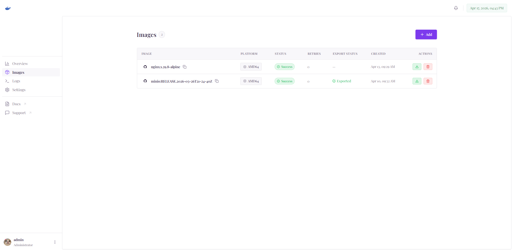
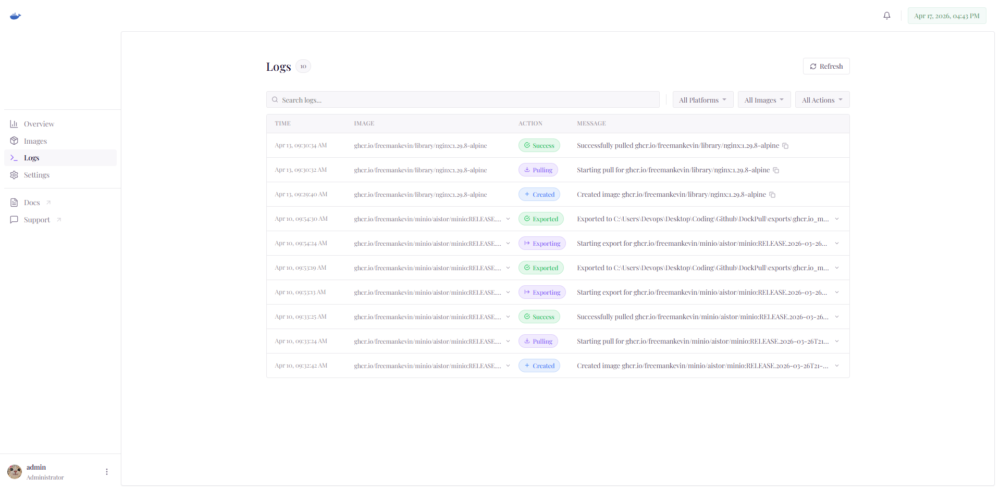
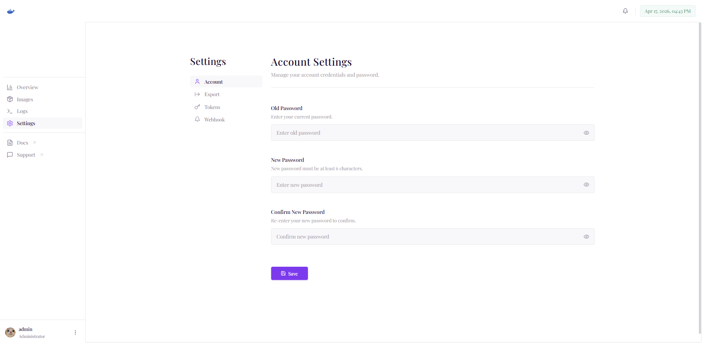

# DockerPull

Docker 镜像拉取和导出管理工具。

## 功能特性

- 🐳 Docker 镜像拉取管理
- 📦 镜像导出功能
- 🎯 简洁的 Web 界面
- ⚡ 快速部署

## 界面截图

### 登录页面


### 主页面


### 日志页面


### 设置页面


## 快速开始

### 环境要求

- Docker 20.10+
- Go 1.21+ (开发环境)
- Node.js 18+ (前端开发)

### 启动服务

```bash
# 启动后端（端口 9238）
cd app && ./startup.sh

# 启动前端（端口 8212）
./startup.sh
```

## 使用说明

1. 访问 `http://localhost:8212` 打开 Web 界面
2. 输入需要拉取的 Docker 镜像地址
3. 点击拉取按钮，等待镜像下载完成
4. 可选择导出镜像为 tar 文件

## 开发指南

### 后端开发

```bash
cd app && ./startup.sh
```

脚本会自动：
- 检查端口占用
- 编译最新代码（如需要）
- 下载依赖（如需要）
- 启动后端服务

### 前端开发

```bash
./startup.sh
```

脚本会自动：
- 检查并安装依赖
- 启动前端开发服务器

## 贡献指南

欢迎提交 Issue 和 Pull Request！

### 提交 Issue

如果您遇到问题或有功能建议，请 [提交 Issue](https://github.com/freemankevin/DockerPull/issues/new/choose)。

### 提交 PR

1. Fork 本仓库
2. 创建功能分支 (`git checkout -b feature/AmazingFeature`)
3. 提交更改 (`git commit -m 'Add some AmazingFeature'`)
4. 推送到分支 (`git push origin feature/AmazingFeature`)
5. 提交 Pull Request

## 许可证

本项目采用 MIT 许可证 - 查看 [LICENSE](LICENSE) 文件了解详情